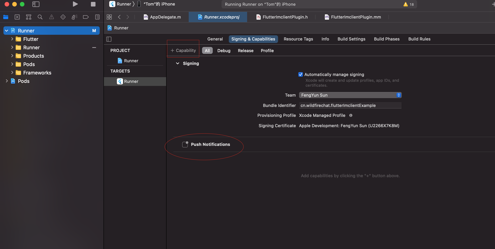

# Flutter_IMClient
野火IM Flutter插件。

## 运行
进入到项目工程目录下，依次执行下述命令：
1. ``` flutter packages get```
2. ``` cd example/ios/ && pod install ```(仅iOS平台需要)
3. ``` flutter run ```

## 集成到flutter应用
1. 在项目的```pubspec.yaml```文件依赖配置中，添加如下内容。其中 ```${path_to_flutter_imclient}``` 为 ```Flutter_IMClient``` 项目目录。
```
dependencies:
  flutter:
    sdk: flutter

  flutter_imclient:
    path: ${path_to_flutter_imclient}
```
2. 项目目录下执行 ``` flutter packages get``` 命令。
3. 如果有iOS平台，执行 ``` cd example/ios/ && pod install ``` 命令。
4. 如果有Android平台，使用 ```android studio``` 打开项目的android目录：
    + 4.1 选择菜单```File```->```New```->```New Module```->选择```Import .JAR/.AAR Package```->选择 ```Flutter_IMClient```项目下```example/android/mars-release-core/mars-release-core.aar```文件，最后选择导入。

    + 4.2 选择菜单```File```->```New```->```Import Module```->选择 ```Flutter_IMClient```项目下```example/android/push```目录，选择导入。

    + 4.3 修改您的Android项目的根```build.gradle```文件，找到下面位置，加上华为仓库的地址。至此客户端可以编译通过。

    ```
    allprojects {
        repositories {
            google()
            jcenter()
            //添加华为仓库地址
            maven {
                url "http://developer.huawei.com/repo/"
            }
        }
    }
    ```

    + 4.4 修改您的Android项目的应用的```build.gradle```文件，修改```minSdkVersion```为19

    ```
    defaultConfig {
            ...
            minSdkVersion 19
            ...
        }
    ```
    
7. 分别运行iOS平台和Android平台。

## SDK的使用
### 基础知识
必须对野火IM有一定认识后才可以顺利使用，建议做到以下几点：
1. 仔细阅读野火[基础知识](https://docs.wildfirechat.cn/base_knowledge/)，建议最好把[文档](https://docs.wildfirechat.cn)都看一遍，仔细阅读一遍绝对会物超所值的。
2. 仔细查看插件的接口文件```FlutterImclient.dart```文件，大概130+个接口，根据接口名称和简单的注释还有参数，了解到具体的功能，这样后面使用时也比较好找。
3. 查看插件带的demo应用。demo应用十分不完善，但也基本能反应出使用的方法，如果您有时间可以给我们提PR来完善这个demo。
4. 如果您有原生客户端开发经验，可以查看对于客户端的demo，原生客户端demo比较完善。

### 初始化
初始化在应用启动时唯一调用一次即可，参数是各种事件的回调。
```
FlutterImclient.init(...);
```

### 连接
连接需要```IM Token```，必须在应用服务进行获取```token```，获取```token```时必须使用从SDK内获取到的```clientId```，否则会连接不上。
```
var clientId = await FlutterImclient.clientId;
// 调用应用服务去IM服务获取token，需要使用从SDK内获取的clientId。得到token后调用connect函数。
FlutterImclient.connect(Config.IM_Host, userId, token);
```

### 获取会话列表
展示用户的所有会话的列表使用。
```
FlutterImclient.getConversationInfos([ConversationType.Single, ConversationType.Group, ConversationType.Channel], [0]);
```

### 获取消息
从指定会话获取消息，可以指定消息其实id和获取条目数，实际使用时可以滚动加载。
```
FlutterImclient.getMessages(conversation, 0, 10);
```

### 发送消息
构造消息内容，把消息发送到指定会话去。
```
FlutterImclient.sendMessage(conversation, txtMsgContent);
```

### 获取用户信息
refresh参数表明是否强制从服务器刷新用户信息，函数会返回本地数据库存储用户信息，如果不存在将返回null。refresh为true或者用户信息不存在时会从服务器更新用户信息，如果信息有变化，会通过用户信息变更回调通知。注意仅当单聊会话和用户详情时强制刷新，避免反复refresh调用出现死循环。
```
getUserInfo(userId, refresh:false);
```

### 获取群组信息
获取群组信息，具有可选参数refresh，refresh的使用方法请参考获取用户信息。
```
getGroupInfo(groupId, refresh:false);
```

## 推送
### Android平台
0. 推送的集成需要有Android原生开发的经验、需要能够根据手机厂商的推送服务说明进行集成推送SDK的能力、需要能够了解[野火IM推送运行原理](https://github.com/wildfirechat/push_server)。
2. 拷贝```Flutter_IMClient```项目下```example/android/app/src/main/java/cn/wildfirechat/flutter_imclient_example/MainActivity.java```文件中注释指定的内容拷贝到您的项目这个文件中对应位置。
4. 找到第一步导入的push目录下的```build.gradle```文件，找到如下位置。需要去对应手机厂商申请账户和开通推送服务，并分别替换如下各个参数。
```
        manifestPlaceholders = [
                MI_APP_ID    : "2882303761517722456",
                MI_APP_KEY   : "5731772292456",

                HMS_APP_ID   : "100221325",

                MEIZU_APP_ID : "113616",
                MEIZU_APP_KEY: "fcd886f51c144b45b87a67a28e2934d1",

                VIVO_APP_ID  : "12918",
                VIVO_APP_KEY : "c42feb05-de6c-427d-af55-4f902d9e0a75",

                OPPO_APP_KEY  : "16c6afe503b24259928e082ef01a6bf2",
                OPPO_APP_SECRET : "16c6afe503b24259928e082ef01a6bf2"
        ]
```
5. 运行起程序后，在```FlutterImclientPlugin.java```文件中，找到如下函数。如果能够被回调到就是客户端集成成功。注意是需要每个手机厂商的手机都要测试一遍。
```
public void onPushToken(int pushType, String pushToken) {
  ...
}
```
6. 客户端集成后，需要跟推送服务进行联调，如果无法联通，需要根据推送服务厂商排查说明处理。

### iOS平台
0. 推送的集成需要有iOS原生开发的经验、需要能够处理APNS服务的能力、需要能够了解[野火IM推送运行原理](https://github.com/wildfirechat/push_server)。
1. 为当前应用添加推送服务，可以xcode打开项目，然后选中```Signing&Capabilities```标签页，点击```+Capability```按钮，选中```Push Notification```。如下图所示:

2. 打开```example/ios/Runner/AppDelegate.m```文件，把文件中注释标注的代码块拷贝到目标工程中的同名文件对应位置。
3. 编译debug运行程序，在```AppDelegate.m```中下面代码处加上断点，点击允许推送，检测是否走到断点位置，如果走到说明集成客户端成功。
```
[cls performSelector:@selector(setDeviceToken:) withObject:token];
```
4. 与正常集成APNS一样，生产推送证书，配置推送服务，与推送服务进行联调。

## 一些知识要点
1. 获取token的过程一定是先从客户端获取clientId，然后应用服务使用clientId和userId参数获取token，返回给当前客户端使用。即token是和客户端绑定的，该token仅能在当前客户端使用。
2. 获取用户/群组/频道信息时，都是直接返回本地数据，如果本地没有会返回null且去服务器更新，更新成功后会有eventbus通知。编写UI代码时需要考虑到获取信息为空的可能，并做好监听，以便信息更新能更新UI。
3. 展示消息是分批获取的，先获取最新的一部分，然后列表滚动式再加载下一批，以此类推。
