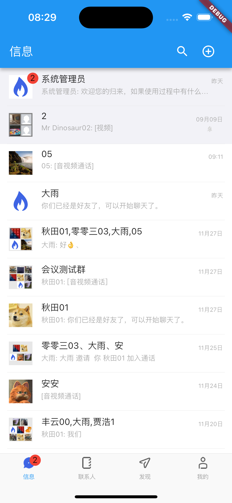
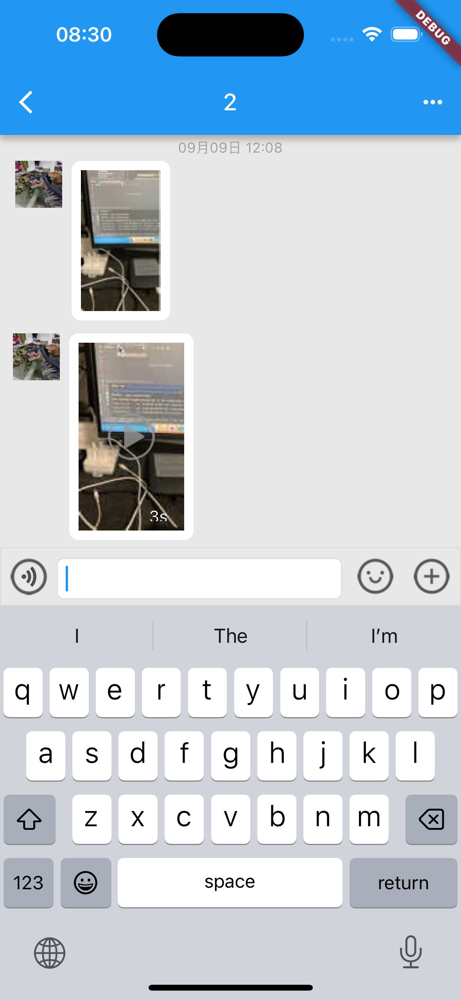
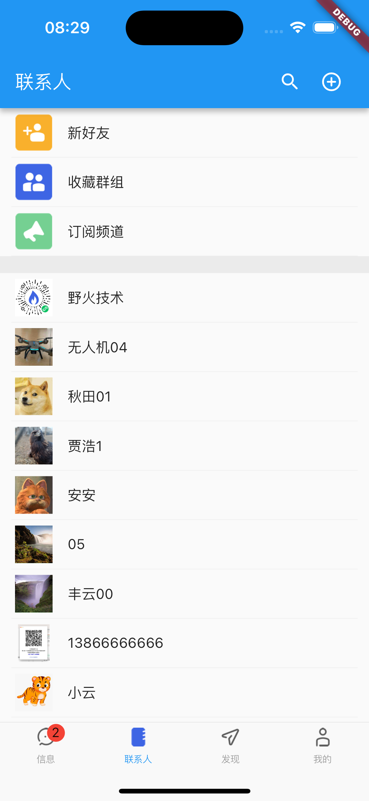
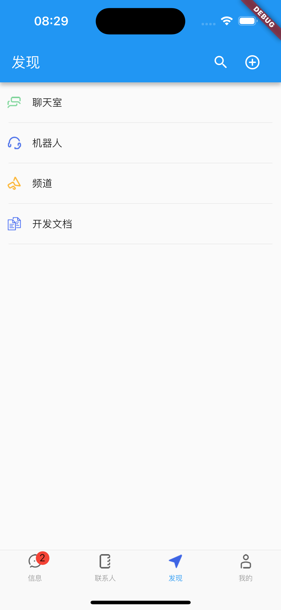
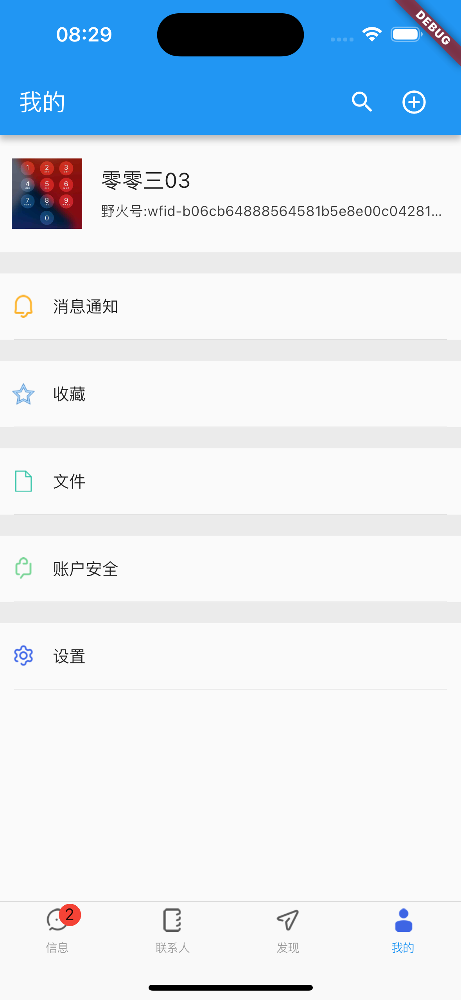
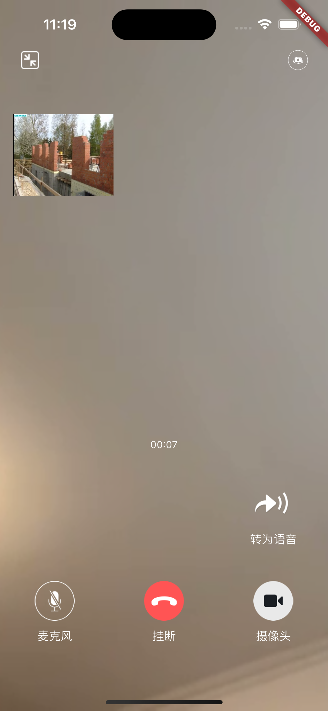
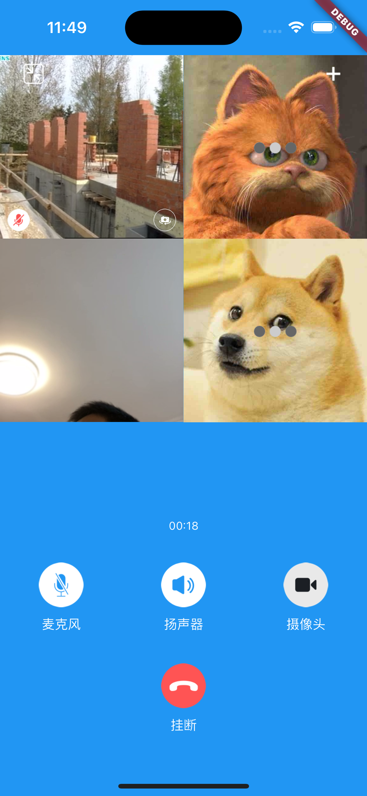

## 野火IM解决方案

野火IM是专业级即时通讯和实时音视频整体解决方案，由北京野火无限网络科技有限公司维护和支持。

主要特性有：私有部署安全可靠，性能强大，功能齐全，全平台支持，开源率高，部署运维简单，二次开发友好，方便与第三方系统对接或者嵌入现有系统中。详细情况请参考[在线文档](https://docs.wildfirechat.cn)。

主要包括一下项目：

| [GitHub仓库地址(主站)](https://github.com/wildfirechat)            | [码云仓库地址(镜像)](https://gitee.com/wfchat)                | 说明                                                             | 备注                      |
|--------------------------------------------------------------|-------------------------------------------------------|----------------------------------------------------------------|-------------------------|
| [android-chat](https://github.com/wildfirechat/android-chat) | [android-chat](https://gitee.com/wfchat/android-chat) | 野火IM Android SDK源码和App源码                                       | 可以很方便地进行二次开发，或集成到现有应用当中 |
| [ios-chat](https://github.com/wildfirechat/ios-chat)         | [ios-chat](https://gitee.com/wfchat/ios-chat)         | 野火IM iOS SDK源码和App源码                                           | 可以很方便地进行二次开发，或集成到现有应用当中 |
| [pc-chat](https://github.com/wildfirechat/pc-chat)           | [pc-chat](https://gitee.com/wfchat/pc-chat)           | 基于[Electron](https://electronjs.org/)开发的PC平台应用                 |                         |
| [web-chat](https://github.com/wildfirechat/web-chat)         | [web-chat](https://gitee.com/wfchat/web-chat)         | Web平台的Demo, [体验地址](http://web.wildfirechat.cn)                 |                         |
| [wx-chat](https://github.com/wildfirechat/wx-chat)           | [wx-chat](https://gitee.com/wfchat/wx-chat)           | 微信小程序平台的Demo                                                   |                         |
| [server](https://github.com/wildfirechat/server)             | [server](https://gitee.com/wfchat/server)             | IM server                                                      |                         |
| [app server](https://github.com/wildfirechat/app_server)     | [app server](https://gitee.com/wfchat/app_server)     | 应用服务端                                                          |                         |
| [robot_server](https://github.com/wildfirechat/robot_server) | [robot_server](https://gitee.com/wfchat/robot_server) | 机器人服务端                                                         |                         |
| [push_server](https://github.com/wildfirechat/push_server)   | [push_server](https://gitee.com/wfchat/push_server)   | 推送服务器                                                          |                         |
| [docs](https://github.com/wildfirechat/docs)                 | [docs](https://gitee.com/wfchat/docs)                 | 野火IM相关文档，包含设计、概念、开发、使用说明，[在线查看](https://docs.wildfirechat.cn/) |                         |  |

## 技术交流

1. 如果大家发现bug，请在GitHub或码云提issue；如果有需求也请给我们提issue。
2. 其他问题，请到[野火IM论坛](http://bbs.wildfirechat.cn/)进行交流学习
3. 关注我们的公众号。我们有新版本发布或者有重大更新会通过公众号通知大家，另外我们也会不定期的发布一些关于野火IM的技术介绍。


我们有核心研发工程师轮流值班处理issue和论坛，会及时处理的，疑难Bug的修改和新需求的开发我们也会尽快解决。

# WFC Flutter Plugins

野火Flutter插件，包含即时通讯插件和实时音视频插件，包含Flutter Demo。

## 关于 flutter 、Android Studio、gradle 版本的重要说明

1. 为了能够兼容鸿蒙原生系统，flutter 版本会跟随鸿蒙原生已适配的flutter 版本进行升级，目前鸿蒙原生已适配的flutter版本是`3.22.0`
2. Android Studio 会跟随官方更新，一直使用最新版本
3. 由于 gradle 版本和 flutter 版本有依赖关系，会使用对应的 gradle 版本，目前是 `8.7`


## 常见问题

1. `Execution failed for task ':video_player_android:compileDebugJavaWithJavac'.`
    1. 查看 `example/.flutter-plugins` 找到 `video_player_android` 的位置，macos 时，位置如下: `video_player_android=/Users/your-user-name/.pub-cache/hosted/pub.flutter-io.cn/video_player_android-2.7.1/`
    2. 参考[Remove -Werror from Android build](https://github.com/flutter/packages/pull/7776/files) 修改`android/build.gradle`
2. 鸿蒙上提示包找不到，请从 [flutter_packages](https://gitcode.com/openharmony-tpc/flutter_packages) 查询已适配鸿蒙平台的版本，并固定为该版本

## 运行
> 鸿蒙平台时，先参考[这儿](https://gitcode.com/openharmony-tpc/flutter_flutter)进行相关配置

进入到项目工程目录下，依次执行下述命令：

1. ``` cd example && flutter packages get && cd .. ```
2. ``` cd example/ios/ && pod install && cd ..```(仅iOS平台需要)
3. ``` cd example && flutter run ```

## 集成到flutter应用

1. 在项目的```pubspec.yaml```文件依赖配置中，添加如下内容。其中 ```${path_to_imclient}``` 和 ```${path_to_imclient}``` 为 本项目的```imclient```和```rtckit```目录。
    ```
    dependencies:
      flutter:
        sdk: flutter

      imclient:
        path: ${path_to_imclient}
      rtckit:
        path: ${path_to_rtckit}
    ```

2. 在项目```android/app/build.gradle```文件中配置混淆规则，并添加依赖
   ```groovy
      buildTypes {
        release {
            // Signing with the debug keys for now, so `flutter run --release` works.
            signingConfig signingConfigs.debug
            shrinkResources true
            // 是否开启混淆，如果开启了混淆，需要在proguard-rules.pro中添加规则，可参考build.gradle同目录中的混淆棍子，避免混淆掉野火IM相关类。
            // 如果开启混淆，但混淆规则配置错误，应用可能无法启动，或不能正常连接到IM服务。
            minifyEnabled true
            proguardFiles getDefaultProguardFile('proguard-android.txt'), 'proguard-rules.pro'
        }
        debug{
            signingConfig signingConfigs.debug
            shrinkResources true
            // 是否开启混淆，如果开发调试阶段，不想开启混淆，需要显示配置为false。
            minifyEnabled false
        }
    }


      dependencies {

        // 将path_to_android_xxx_aars 替换成实际路径，可以使用相对路径，但一定要保证路径是正确的；路径不对的话，会报 ClassNotFoundException
        // moment 对应的是朋友圈SDK，ptt对应的是对接SDK。仅当购买或者试用这两个功能的用户打开这两个包的引入。

        // wfc dep start
        implementation fileTree(dir: "${path_to_android_client_aars}", include: ["*.aar"])
        implementation fileTree(dir: "${path_to_android_avclient_aars}", include: ["*.aar"])
        //implementation fileTree(dir: "${path_to_android_moment_aars}", include: ["*.aar"])
        //implementation fileTree(dir: "${path_android_ptt_aars}", include: ["*.aar"])

        // wfc dep end
    }
    ```

3. 项目目录下执行 ``` flutter packages get``` 命令。
4. 如果有iOS平台，执行 ``` cd example/ios/ && pod install ``` 命令。
5. 分别运行iOS平台和Android平台。
6. Android 平台，集成音视频的时候，需要在`AndroidManifest.xml`入口`activity`的配置里面添加如下`intent-filter`
   ```xml
    <!-- 音视频通话，需要加入下面的 intent-filter-->
    <intent-filter>
        <action android:name="${applicationId}.main" />
        <category android:name="android.intent.category.DEFAULT" />
    </intent-filter>

    ```

## 升级插件注意事项

1. 升级插件时，一定要记得同步升级`android_client_aars`和`android_avclient_aars`等`aars`目录

## SDK的使用

### 基础知识

必须对野火IM有一定认识后才可以顺利使用，建议做到以下几点：

1. 仔细阅读野火[基础知识](https://docs.wildfirechat.cn/base_knowledge/)，建议最好把[文档](https://docs.wildfirechat.cn)都看一遍，仔细阅读一遍绝对会物超所值的。
2. 仔细查看插件的接口文件```Imclient.dart```文件，大概130+个接口，根据接口名称和简单的注释还有参数，了解到具体的功能，这样后面使用时也比较好找。
3. 查看插件带的demo应用。demo应用十分不完善，但也基本能反应出使用的方法，如果您有时间可以给我们提PR来完善这个demo。
4. 如果您有原生客户端开发经验，可以查看对于客户端的demo，原生客户端demo比较完善。

### 初始化

初始化在应用启动时唯一调用一次即可，参数是各种事件的回调。

```
Imclient.init(...);
```

### 连接

连接需要```IM Token```，必须在应用服务进行获取```token```，获取```token```时必须使用从SDK内获取到的```clientId```，否则会连接不上。

```
var clientId = await Imclient.clientId;
// 调用应用服务去IM服务获取token，需要使用从SDK内获取的clientId。得到token后调用connect函数。
Imclient.connect(IM_Host, userId, token);
```

### 获取会话列表

展示用户的所有会话的列表使用。

```
Imclient.getConversationInfos([ConversationType.Single, ConversationType.Group, ConversationType.Channel], [0]);
```

### 获取消息

从指定会话获取消息，可以指定消息其实id和获取条目数，实际使用时可以滚动加载。

```
Imclient.getMessages(conversation, 0, 10);
```

### 发送消息

构造消息内容，把消息发送到指定会话去。

```
Imclient.sendMessage(conversation, txtMsgContent);
```

### 获取用户信息

refresh参数表明是否强制从服务器刷新用户信息，函数会返回本地数据库存储用户信息，如果不存在将返回null。refresh为true或者用户信息不存在时会从服务器更新用户信息，如果信息有变化，会通过用户信息变更回调通知。注意仅当单聊会话和用户详情时强制刷新，避免反复refresh调用出现死循环。

```
Imclient.getUserInfo(userId, refresh:false);
```

### 获取群组信息

获取群组信息，具有可选参数refresh，refresh的使用方法请参考获取用户信息。

```
Imclient.getGroupInfo(groupId, refresh:false);
```

### 发起单人音视频通话

```
SingleVideoCallView callView = SingleVideoCallView(userId:userId, audioOnly:false);
Navigator.push(context, MaterialPageRoute(builder: (context) => callView));
```

### 发起多人音视频通话

```
GroupVideoCallView callView = GroupVideoCallView(groupId: groupId, participants: members);
Navigator.push(context, MaterialPageRoute(builder: (context) => callView),);
```

## 推送

### 1 野火推送基础知识

实现推送需要客户端和服务端研发配合实现，首先需要掌握野火推送的流程才可以，关于野火推送的知识，在[野火推送服务](https://gitee.com/wfchat/push_server)的项目说明上有详细描述，请客户端研发和服务端研发详细阅读。

### 2 推送平台的选取

目前有多种推送方案可选，可以选取手机厂商的推送，也可以选取第三方推送。需要根据您的需求来选取适合您的方案。

### 3 客户端的集成

客户端集成选取的推送平台的flutter插件，每个推送插件注册成功后，都会返回一个注册ID（或者是其他名称，能够唯一代表当前推送设备的ID），然后调用```imclient```的下面接口

```
Imclient.setDeviceToken(pushType, deviceToken);
```

### 4 服务端推送开发

下载[野火推送服务](https://gitee.com/wfchat/push_server)，在此基础上进行二次开发。推送服务会收到IM服务的推送请求，推送请求中有这个pushType和deviceToken及要推送的内容，推送服务根据这些信息找到对应厂商进行推送。

### 5 使用个推

实际上可以选用任意一个或者多个推送服务商，这里给出一个使用个推的介绍。
[对接个推](https://gitee.com/wfchat/wfc_flutter_plugins/issues/I6P16V?from=project-issue)

## 音视频的历史问题
野火在flutter项目上的音视频的实现有2个方案：
1. 方案1：使用原生UI，就是把android平台和ios平台的音视频SDK和UI代码全都集成到flutter项目中。这种方案的问题是引入的无关代码太多，且原生UI无法修改，跟flutter互通也很不方便，不利于二次开发。
2. 方案2：是使用原生的音视频SDK，但UI层使用dart语言编写，UI和SDK使用flutter插件的方式沟通。这种方案引入的SDK比较小，且修改方便，有利于大家做自定义。

我们在2023.11.29日起，正式采用方案2，同时方案1保留在```native-rtc-ui```分支。已经使用方案1的用户可以继续使用```native-rtc-ui```的分支，如果有需求可以切换到```master```分支去，以后我们的开发重点将会放到```master```分支上去。

## iOS平台使用Callkit
在国外是可以使用callkit的，需要使用callkit时，推送服务需要配置启用callkit。另外客户端这边也需要做一些处理来支持callkit，首先代码中搜索
```dart
Rtckit.enableCallkit()
```
把这句话的注释打开。另外打开iOS工程，在应用的依赖库中添加```CallKit.framework```和```PushKit.framework```，另外在项目的```Signing & Capabilities```中添加```Background Modes```中添加```Audio, AirPlay, and Picture in Picture```, ```Voice over IP```和```Remote Notification```（如果找不到请百度一下）。

## 截图
会话列表



消息界面



联系人列表



发现界面



设置界面



单人视频通话



多人视频通话




## 一些知识要点

1. 获取token的过程一定是先从客户端获取clientId，然后应用服务使用clientId和userId参数获取token，返回给当前客户端使用。即token是和客户端绑定的，该token仅能在当前客户端使用。
2. 获取用户/群组/频道信息时，都是直接返回本地数据，如果本地没有会返回null且去服务器更新，更新成功后会有eventbus通知。编写UI代码时需要考虑到获取信息为空的可能，并做好监听，以便信息更新能更新UI。
3. 展示消息是分批获取的，先获取最新的一部分，然后列表滚动式再加载下一批，以此类推。
4. 免费版本音视频需要用到turn服务，上线前请部署自己的turn服务，野火提供开发的带宽比较小无法支持商用。
5. IM服务init时可以传入各种事件的回调，另外基本上每个事件都会同时触发EventBus事件通知，当需要某个通知时也可以用EventBus事件，所有事件定义在```imclient.dart```文件中，比如```ConnectionStatusChangedEvent```是连接状态变化事件。其他事件可以在这附近找到。
